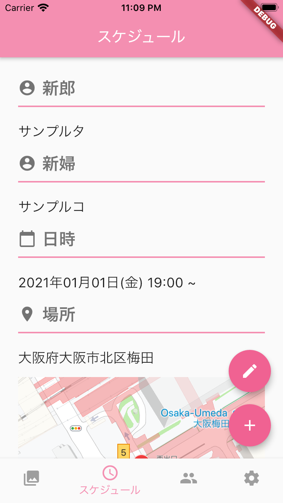

# inbear

### はじめに
#### GoogleMapAPI設定
1. `lib` 配下に `api_keys.dart` を以下のように作成し、各開発環境の Google Maps API Key を追加すること
```
class ApiKeys {
    static const devGoogleApiKey = 'ここにdevelopment環境のAPI Key';
    static const stgGoogleApiKey = 'ここにstaging環境のAPI Key';
    static const prodGoogleApiKey = 'ここにproduction環境のAPI Key';
}
```

2. android/src/[development, staging, production]/res/values　配下に `string.xml` を以下のように作成し、アプリ名と Google Maps API Key を設定
```
<?xml version="1.0" encoding="utf-8"?>
<resources>
    <string name="app_name">[ここにアプリ名]</string>
    <string name="google_map_api_key">[ここにGoogleMapsAPIKey]</string>
</resources>
```

3. ios/Runner 配下に `ApiKeys.swift` を以下のように作成し、Google Maps API Key を設定
```
import Foundation
let googleMapApiKeyDev = "ここにdevelopment環境のAPI Key"
let googleMapApiKeyStg = "ここにstaging環境のAPI Key"
let googleMapApiKeyProd = "ここにproduction環境のAPI Key"
```

#### Firebase設定
1. android/src/[development, staging, production]/res　配下にそれぞれの環境の `google-services.json` は配置
2. ios/Runner/Firebase 配下に development 環境の `GoogleService-Info.plist` を `GoogleService-Info-Development.plist` へリネームして配置。Staging、Production 環境の `GoogleService-Info.plist` も同じようにリネームして ios/Runner/Firebase 配下に配置

### 開発環境
[](https://developer.apple.com/jp/xcode/)
[](https://developer.apple.com/jp/xcode/)
[](https://developer.android.com/studio/)

### 構成
| パッケージ名 | 目的 | 備考 |
|---|---|---|
| api | 外部API呼び出し |  |
| datasource  | アプリ内やFirebase Storageへのデータ保存や呼び出し |  |
| entity | Firestoreのドキュメントフィールドを持つクラス群 |  |
| exception  | 独自定義の例外 |  |
| localize  | 文言管理  |  |
| model  | アプリ内で使用するモデルクラス群 |  |
| repository  | FirestoreやStorage、APIへのアクセスとキャッシュ |  |
| view  | UIや共通パーツ  |   |
| viewmodel  | 画面反映やロジックなど |  |

### ライブラリ
| 名前 | バージョン | 用途 |
|---|---|---|
| [cupertino_icons](https://pub.dev/packages/cupertino_icons) | 0.1.3  |  iOS用のアイコン使用のため |
| [google_fonts](https://pub.dev/packages/google_fonts) | 1.1.0 | Googleフォントの使用のため |
| [google_maps_flutter](https://pub.dev/packages/google_maps_flutter) | 0.5.27+3 | GoogleMapの表示 |
| [firebase_core](https://pub.dev/packages/firebase_core) | 0.4.4+3 | Firebase Core API |
| [firebase_analytics](https://pub.dev/packages/firebase_analytics) | 5.0.11 | アナリティクス |
| [firebase_auth](https://pub.dev/packages/firebase_auth) | 0.16.0 | 認証 |
| [cloud_firestore](https://pub.dev/packages/cloud_firestore) | 0.13.5 | データベース |
| [firebase_storage](https://pub.dev/packages/firebase_storage) | 3.1.5 | ストレージ |
| [provider](https://pub.dev/packages/provider) | 4.1.2 | 状態管理＆DI |
| [flutter_datetime_picker](https://pub.dev/packages/flutter_datetime_picker) | 1.3.8 | 日付日時選択 |
| [http](https://pub.dev/packages/http) | 0.12.1 | 通信 |
| [multi_image_picker](https://pub.dev/packages/multi_image_picker) | 4.6.7 | 画像の複数選択 |
| [uuid](https://pub.dev/packages/uuid) | 2.0.4 | ユニークID作成 |
| [extended_image](https://pub.dev/packages/extended_image) | 0.7.3+1 | 画像表示 |
| [async](https://pub.dev/packages/async) | 2.4.1 | 非同期処理 |
| [shared_preferences](https://pub.dev/packages/shared_preferences) | 0.5.7+3 | アプリ内保存＆読み込み |
| [auto_size_text](https://pub.dev/packages/auto_size_text) | 2.1.0 | テキストサイズの自動調整 |
| [package_info](https://pub.dev/packages/package_info) | 0.4.1 | アプリ情報取得 |
| [smooth_page_indicator](https://pub.dev/packages/smooth_page_indicator) | 0.1.5 | PageViewのインジケータ |
| [pedantic](https://pub.dev/packages/pedantic) | 1.9.0 | 静的解析 |
| [flutter_launcher_icons](https://pub.dev/packages/flutter_launcher_icons) | 0.7.5 | アプリアイコン作成 |

### Flavor
| 名前 | 用途 |
|---|---|
| Debug-Development | 開発環境デバッグ用 |
| Debug-Staging | ステージング環境デバッグ用  |
| Debug-Production | 本番環境デバッグ用  |
| Release-Development | 開発環境リリース用 |
| Release-Staging | ステージング環境リリース用  |
| Release-Production | 本番環境リリース用  |

### ビルド
#### iOS
`--no-codesign` のオプションは署名なしの設定。iOS は Flutter でビルド後に Xcode で Archive が必要で基本 release ビルド。

```
flutter build ios --release --flavor [development or staging or production] --no-codesign
```

#### Android
`--obfuscate --split-debug-info="~/."` のオプションは難読化の設定

```
flutter build [appbundle or apk] --obfuscate --split-debug-info="~/." --[debug or release] --flavor [development or staging or production]
```

### スクリーンショット
　
　
<br><br>
　
　
<br><br>
　
　

